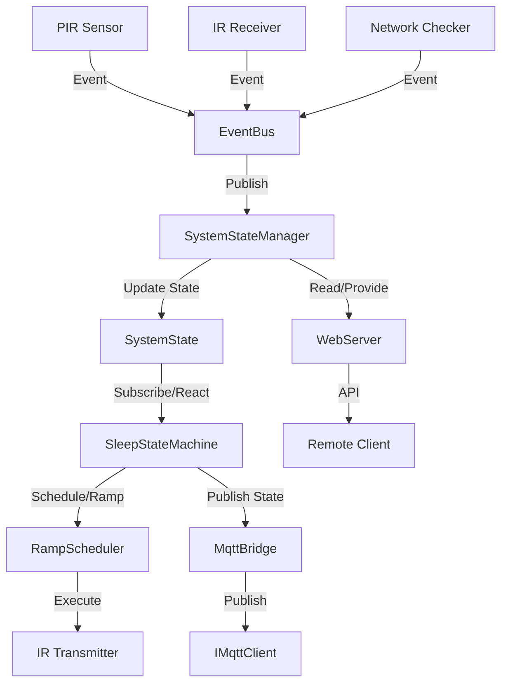

# System Architecture: insomniaTV

This document outlines the high-level architecture and the flow of data within the insomniaTV controller.

## Architecture Overview

The system uses an **Event-Driven Reactive Architecture** centered around an `EventBus`.

## Component Roles

- **EventBus**: Acts as the central nervous system, decoupling hardware-specific interrupts (like IR pulses or PIR triggers) from system-level logic.
- **SystemStateManager**: Serves as the "Brain." It maintains the `SystemState` (Power, Presence, Activity) and processes events asynchronously.
- **SleepStateMachine**: The policy engine. It observes the `SystemStateManager` and dictates the sleep strategy (e.g., ramping volume, turning off TV).
- **RampScheduler**: Manages timing-critical tasks like volume ramping using FreeRTOS timers, triggered by the `SleepStateMachine`.

## State Flow
1. **Input Events**: Sensors trigger events (e.g., `IR_ACTIVITY`, `PIR_ACTIVE`).
2. **State Updates**: `SystemStateManager` receives events and updates the `SystemState`.
3. **Logic Decision**: `SleepStateMachine` detects a state change (e.g., `Activity` moved to `IDLE`) and decides to initiate a sleep ramp.
4. **Action**: `RampScheduler` performs the periodic volume-down commands.
5. **Feedback**: System updates MQTT for remote monitoring.
